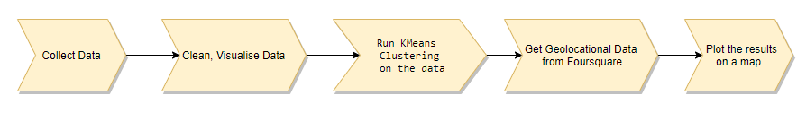
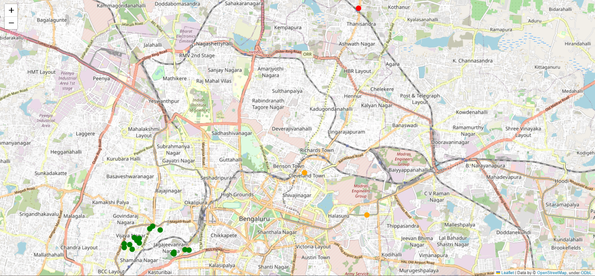

# Apartment-Buddy
# Exploratory-Analysis-Of-Geolocational-Data
Data Collection: Retrieve datasets from relevant sources or locations. This could involve web scraping, accessing databases, or downloading data files.

Data Cleaning: Preprocess and clean the datasets using Pandas or similar data manipulation tools. This step includes handling missing values, removing duplicates, and formatting data.

Data Visualization: Visualize the cleaned data using boxplots. You can utilize libraries like Matplotlib, Seaborn, or Pandas to create these visualizations, which can help identify patterns and outliers.

Geospatial Data Retrieval: Fetch geolocational data from external sources like the Foursquare API or other REST APIs. This data could include location coordinates, venue details, or any other geospatial information relevant to your analysis.

Data Analysis: Apply K-Means Clustering or other clustering algorithms to group locations based on certain criteria. Scikit-Learn is a popular library for implementing K-Means clustering in Python.

Cluster Interpretation: Interpret the results of the clustering analysis to understand the characteristics of each cluster. This step may involve analyzing the features that contributed to the clustering.

Visualization of Clusters: Create visualizations, such as maps, to present the clustered locations. Folium is a useful library for generating interactive maps with clustered data.

Insight Presentation: Summarize and present your findings, insights, and recommendations based on the clustering results and visualizations.
# The project consists of the following stages:

# Result after implementation

# Conclusion

Green: Apartments in the cluster with index 0.
Orange: Apartments in the cluster with index 1.
Red: Apartments in the cluster with index 2.

These colors are used to visually differentiate between the clusters of apartments on the map. Each cluster represents a group of apartments that are similar in terms of their amenities and other factors, as determined by the K-Means clustering algorithm. The specific meaning of each cluster (e.g., proximity to amenities, budget, etc.) would depend on the characteristics of the data and the results of the clustering analysis.
